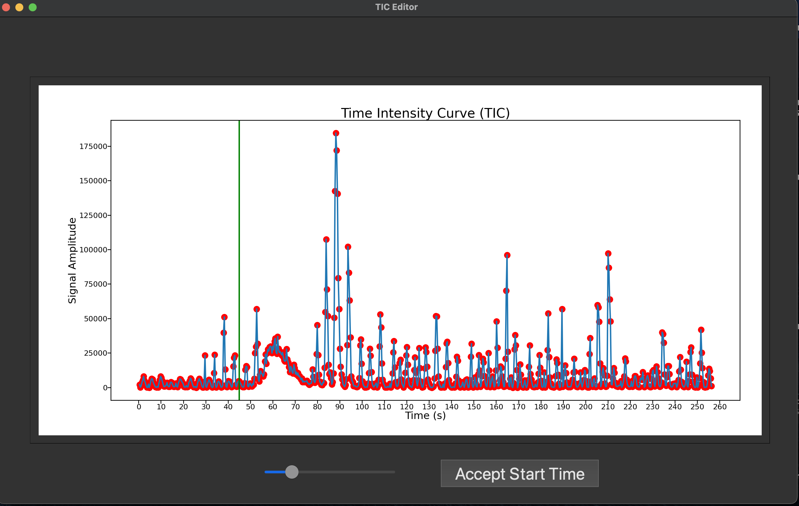
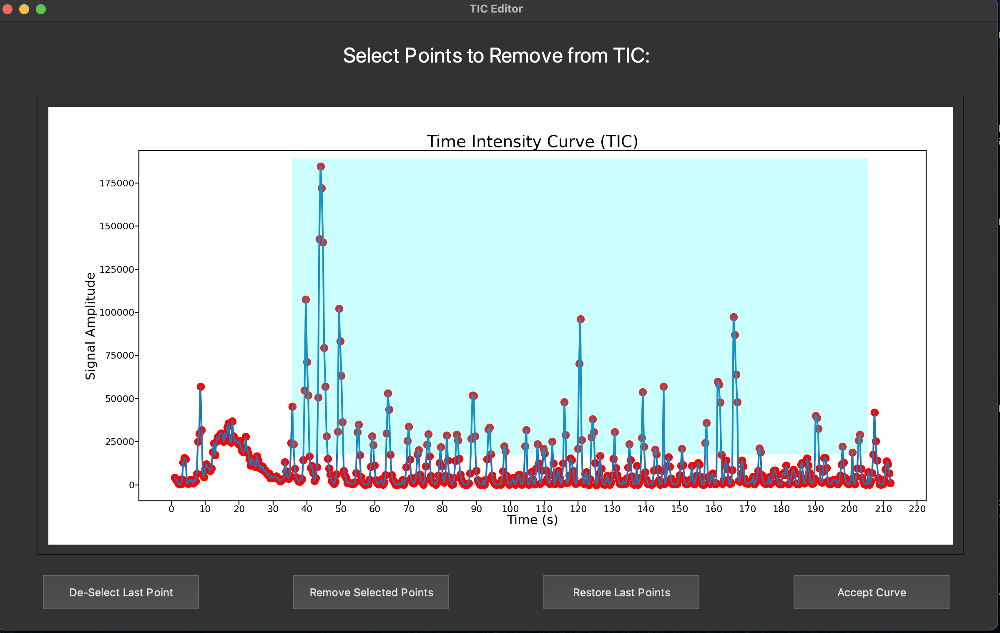
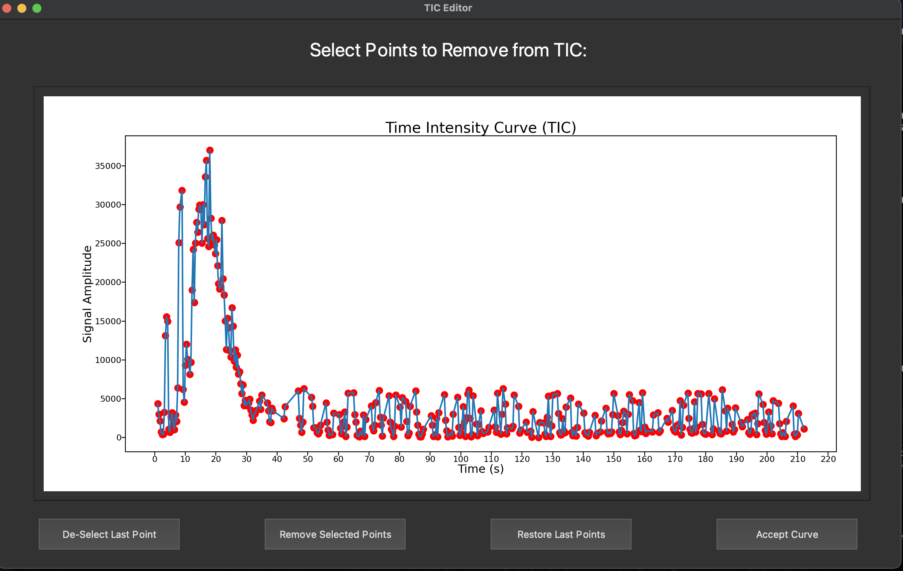
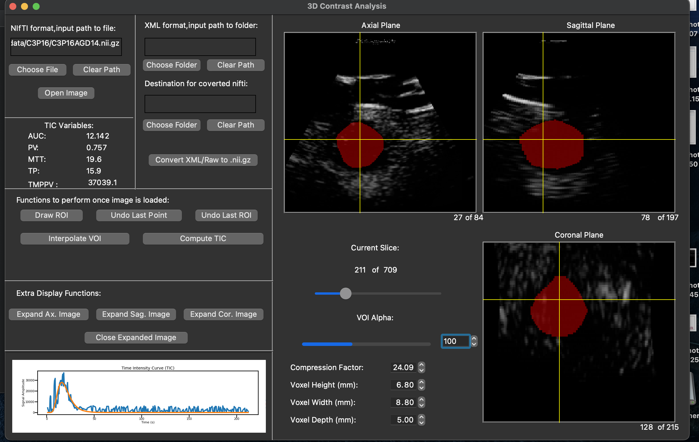

# 3D Contrast Enhanced Ultrasound (CEUS) Analysis GUI

## Overview

This program is a CEUS analyis tool which allows user to input a string of 3D B-Mode images, draw a volume of interest, and view the resulting time intensity curve (TIC).

Next, the user can choose the point to start analysis on the TIC (at point t0), modify the TIC to remove noise from the data, and fit a lognormal curve to the resulting TIC.

### Initial TIC Image



### Modifying TIC



### Final TIC Image



Finally, using this lognormal curve fitting, the program computes the normalized area under the curve (AUC), normalized peak value (PV), normalized time to peak (TP), normalized mean transit time (MTT), and normalizing value (TMPPV).

### Main GUI



## Dependencies

* [Python Version 3.9.13](https://www.python.org/downloads/release/python-3913/)
* [Git](https://git-scm.com/downloads)

## Building

### Mac/Linux

```shell
git clone https://github.com/davidspector67/3dCEUSAnalysis.git
cd 3dCEUSAnalysis
pip install virtualenv
python -m venv venv
source venv/bin/activate
pip install -r pyPackages.txt
deactivate
```

### Windows

```shell
git clone https://github.com/davidspector67/3dCEUSAnalysis.git
cd 3dCEUSAnalysis
pip install virtualenv
python -m venv venv
call \venv\scripts\activate.bat
pip install -r pyPackages.txt
deactivate
```

## Running

### Mac/Linux

```shell
call venv\scripts\activate.bat
python main.py
deactivate
```

### Windows

```shell
source venv/bin/activate
python main.py
deactivate
```

## Create an executable (Optional)

After building the application, you can create a fully packaged application in this repository's directory using:

### Mac/Linux

```shell
source venv/bin/activate
python -m PyInstaller --windowed main.py
deactivate
```

### Windows

```shell
call \venv\scripts\activate.bat
python -m PyInstaller --windowed main.py
deactivate

```
